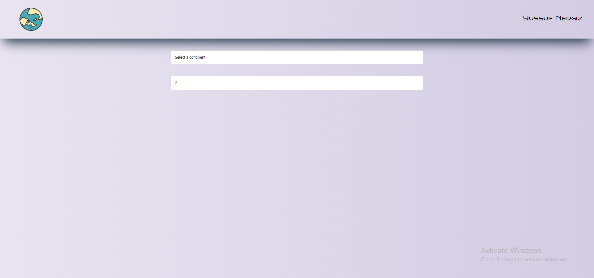
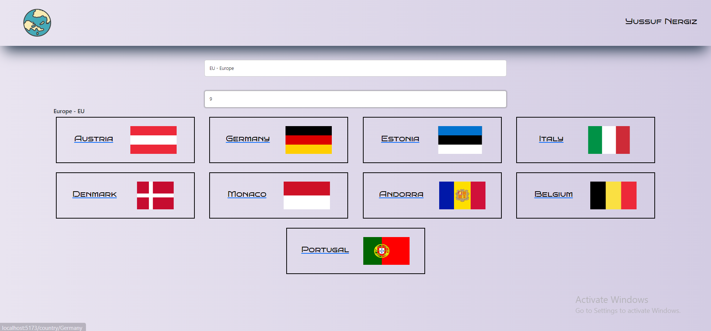
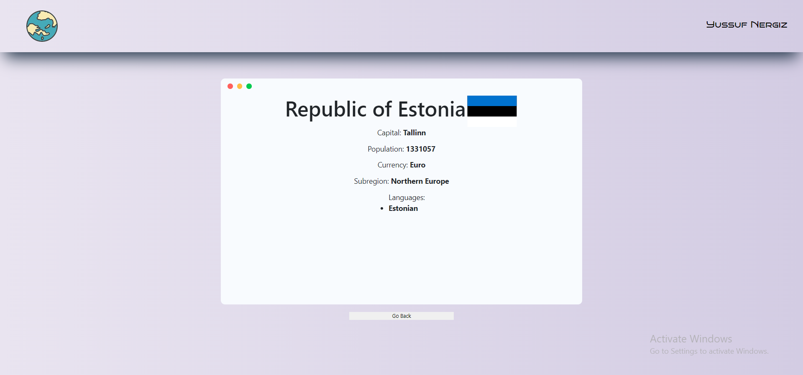

# Vite React App
This is a starter template for a React app using Vite as the build tool.

## Getting Started
Prerequisites
To use this app, you'll need to have Node.js and npm installed on your computer. You can download and install them from the official Node.js website.

## Installing
To get started, follow these steps:

1: Clone the repository:
git clone https://github.com/YusufNergiz/continents-task.git

2: Navigate to the project directory:
cd continents-task/continents-task

3: Install the dependencies:
npm install

# Running the App
To run the app in development mode, run the following command:
npm run dev

This will start the development server and open the app in your default browser.

## Images

